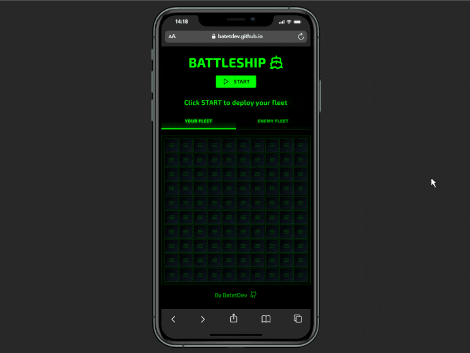

# 🚢 Project: Battleship

A classic Battleship game built with vanilla JavaScript as part of **[The Odin Project](https://www.theodinproject.com/lessons/node-path-javascript-battleship)** JavaScript curriculum.


_Gameplay demo._

## 🎮 Live Demo

**[Play Battleship](https://batetdev.github.io/top-project-battleship/)**

## ✨ Features

- **Smart AI**: Hunt/Target BFS algorithm with intelligent ship tracking
- **Responsive Design**: Works on desktop and mobile devices
- **Modern Stack**: Webpack, Tailwind CSS, Jest testing

## 🚀 Quick Start

```bash
# Clone and install
git clone https://github.com/BatetDev/top-project-battleship.git
cd top-project-battleship
npm install

# Development
npm start           # Start dev server
npm test            # Run tests
npm run build       # Production build
npm run deploy      # Deploy to GitHub Pages
```

## 🏗️ Project Structure

```
src/
├── js/modules/     # Game logic (Game, Player, Gameboard, Ship)
├── styles/         # Tailwind CSS
├── tests/          # Jest test suite
└── index.html      # Main HTML file
```

## 🛠️ Built With

- JavaScript (ES6+)

- Webpack 5 - Module bundler

- Tailwind CSS - Styling

- Jest - Testing framework

- Lucide Icons - SVG icons

## 📚 About

This project was built as part of The Odin Project's JavaScript curriculum to practice:

- Test-Driven Development with Jest

- Object-Oriented Programming patterns

- BFS AI algorithm implementation

- Modern JavaScript tooling
